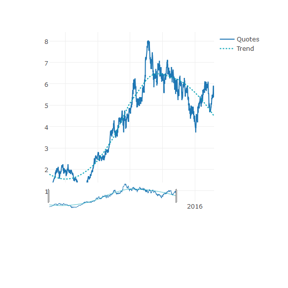

## Shiny App

This app makes it easier for the user to visualize the quotes and trends of NYSE stocks: <https://luizsatolo.shinyapps.io/ddp_project/>.

Special features:
- Trend estimated by local polynomial regression (loess) fitting method
- Date range interactively adjusted with slider below the graph
- Companies information available by Sector and by Industry
- Unkown tickers can be searched for in "All Companies" tab
- Automatically switch tabs as inputs are selected

--- .class #id 

## Interactive graph code

Example for Ambev S.A. ("ABEV")

```r
library(quantmod)
library(plotly)

## getting quotes from yahoo
data<-data.frame(getSymbols("ABEV",src="yahoo",auto.assign = FALSE))
## plotting quotes and trend
plot_ly(data, x = as.Date(row.names.data.frame(data))) %>% 
        add_lines(y = data[,6], name = "Quotes") %>% 
        rangeslider() %>% 
        add_lines(y = ~fitted(loess(data[,6] ~
        as.numeric(as.Date(row.names.data.frame(data))), data)), 
        line = list(color = '#07A4B5', dash = "dot"), name = "Trend",
        showlegend = TRUE) 
        %>% layout(yaxis = list(title = ""))
```

--- .class #id

## Interactive graph sample


Example for Ambev S.A. ("ABEV")


